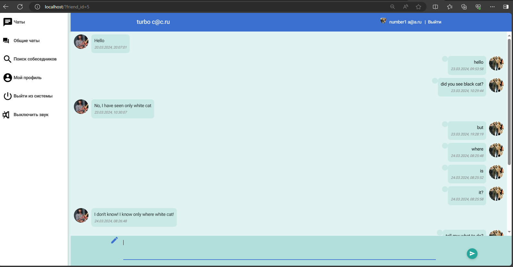

# 
Практическое задание 33. Проект «Мессенджер»

Выполнено в качестве практического задания на курсе "Продвинутый Backend"

Формулировка задания:

 Разработать удобный браузерный клиент, позволяющий пользователям оперативно вступать в диалог с зарегистрированными пользователями.

 Описание мессенджера: 

+ При входе на сайт мессенджера пользователь должен войти по логину и паролю либо пройти регистрацию. 
+ В качестве логина выступает email пользователя.
+ Доступна аутентификация через VK.
+ Страница "Чаты" содержит листинг чатов с теми пользователями, кого пользователь добавил в свои друзья.
+ При клике на собеседника открывается чат с ним. При клике на своём сообщении выпадает меню, с помощью которого можно удалять, редактировать и пересылать сообщение другим пользователям.
+ Страница "Общие чаты" содержит листинг чатов, созданных самим пользователем (максимум 2) и листинг чатов, созданных другими пользователями и в которых состоит пользователь. При клике на соотвествующем чате, открывается групповой чат.
+ В чате с другом и в групповом чате при получении нового сообщения поступит звуковой сигнал уведомления. При этом звук можно включить/отключить через соотвествующую кнопку в меню.
+ Страница "Поиск собеседников" позволяет осуществить поиск пользователей по логину/нику. Если логин искомого пользователя скрыт, то он будет доступен в поиске только по нику.
+ Страница "Мой профиль" позволяет установить/сменить аватар пользователя, скрыть свой e-mail, задать свой ник. Скрыть e-mail можно только после задания своего ника.
+ Страница "Выход из системы" сбрасывает текущую сессию. 

#### Дополнительно
+ Для записка мессенджера не требуется создавать БД. Их автоматически создаст RedBeanPHP.
+ Страница аутентификации создана с CSRF-токеном для защиты от CSRF аттак.
+ Защита от SQL- инъекций обеспечивается ORM RedBeanPHP.
+ Мессенджер работает без использования "Сookie".

## Используемые технологии

* Composer

* ORM RedBeanPHP

* PHP 8.0

* CSS

* JS

## Как открыть/запустить

Создать папку в каталоге ваших доменов, например, для OSP это будет папка c:\Program Files\OSPanel\domains\ . Клонировать https://github.com/KorenevVyacheslav/PHP_Messenger в  папку c вашими доменами. В файле config.php переопределить константы для подключения к вашей БД. Выполнить команду "composer update" для загрузки папки 'vendor'. Запустить index.php. 